# CampusOptix

## Explainable Smart Campus Resource & Classroom Optimizer

CampusOptix is an explainable resource optimization engine and interactive 3D digital twin designed for modern university campuses. It models academic space allocation as an exact Integer Program using Google OR-Tools CP-SAT, generates deterministic step-by-step Rule Traces for every proposed schedule reassignment, and synchronizes live spatial telemetry across administrators, faculty, and students in real time.

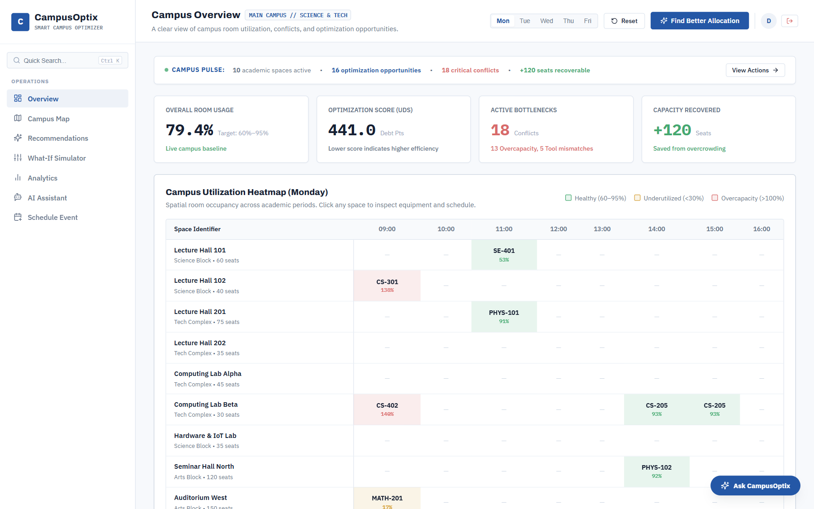

[](#)
[](#)
[](#)
[](#)
[](#)
[](#)
[](#)
[](#)
[](#)

---

## The Problem

Universities face complex scheduling inefficiencies that degrade student learning and inflate operational costs:

1. **Severe Utilization Imbalances**: Prime lecture halls sit at 20–30% capacity for small seminar cohorts, while high-enrollment core courses are assigned to undersized classrooms that exceed fire code thresholds.
2. **Specialized Hardware & Lab Mismatches**: Courses requiring GPU clusters, specialized fume hoods, or smart projectors are often scheduled in standard seminar rooms, while equipped laboratories sit idle.
3. **Faculty Transit & Double-Booking Clashes**: Rapid schedule changes cause schedule conflicts, cross-campus sprint intervals between consecutive lectures, and broken multi-slot lab continuity.
4. **"Black-Box" Resistance**: Academic departments resist automated schedulers because existing tools offer no explainable justification for why a class was relocated or why a specific room was rejected.

---

## The Solution

CampusOptix replaces opaque heuristics with a deterministic, constraint-satisfaction pipeline coupled to an interactive spatial digital twin:

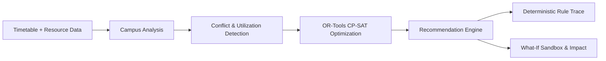

---

## Why CampusOptix

1. **Explainable Optimization**: Every recommendation is backed by a deterministic Rule Trace detailing exact capacity math, equipment checklist verification, clash status, transit distance changes, and score deltas ($\Delta\text{UDS}$).
2. **Constraint-Aware Global Allocation**: Powered by Google OR-Tools CP-SAT constraint programming, finding optimal room-to-event assignments across thousands of variable combinations in milliseconds.
3. **Interactive What-If Simulation**: A drag-and-drop sandbox backed by WebSockets that recalculates campus-wide UDS debt, conflict states, and net score changes in sub-second time before applying changes to the live timetable.
4. **Spatial 3D Digital Twin**: Five distinct Three.js architectural templates (Lecture Hall, Computer Lab, Science Lab, Classroom, Seminar Hall) with procedural seated student avatars reflecting real-time enrollment.
5. **Measurable Institutional Impact**: Quantifies recovered seat hours, fire-safety violations eliminated, average transit reductions, and Utilization Debt Score improvements.
6. **Data-Grounded AI Assistant**: A multi-turn Gemini-powered assistant with a 6-turn function-calling loop connected to 18 live campus data tools, enforcing "Answer First, Action Second" with persistent contextual follow-ups.

---

## Product Tour

### 1. Campus Overview Dashboard
The command center displaying institutional KPIs, average space utilization rate, total Utilization Debt Score (UDS), active conflict alerts, and a spatial timetable grid.


### 2. 2D Architectural Campus Map & Floor Plan
Interactive multi-building campus floor plan with switchable visualization layers (Operations, Utilization % fills, Capacity Headroom, Conflicts, and Equipment) and slide-in room telemetry drawers.

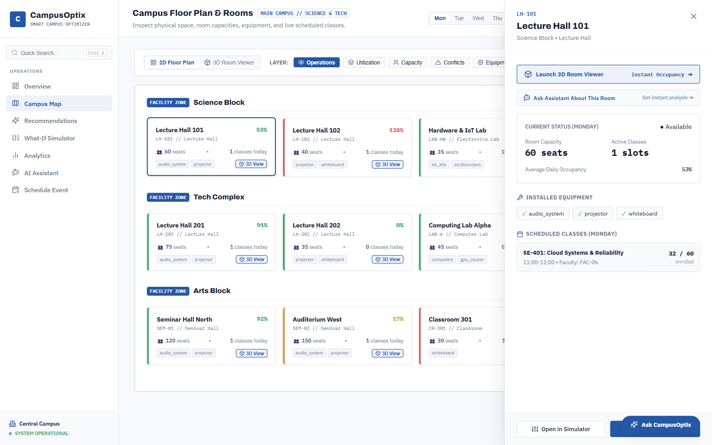

### 3. Shared 3D Room Viewer (Digital Twin)
Procedural 3D spatial room explorer rendering realistic furniture, hardware installations, and human student avatars indicating live seat occupancy and overcapacity warnings.

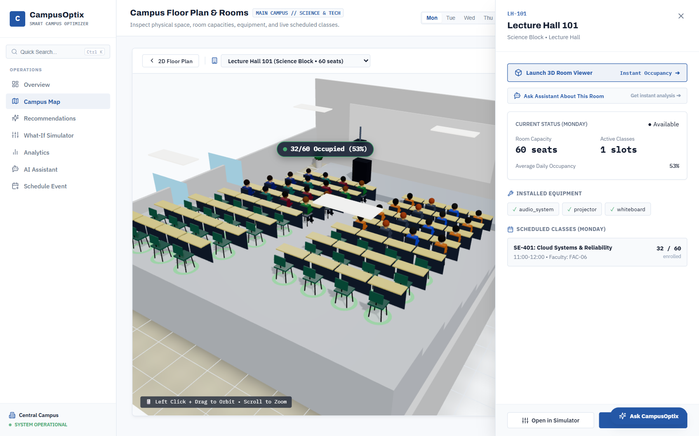

### 4. Optimization Recommendations
A prioritized feed of mathematically verified room reassignments generated by the OR-Tools solver, highlighting before/after occupancy shifts, UDS gains, and one-click execution.

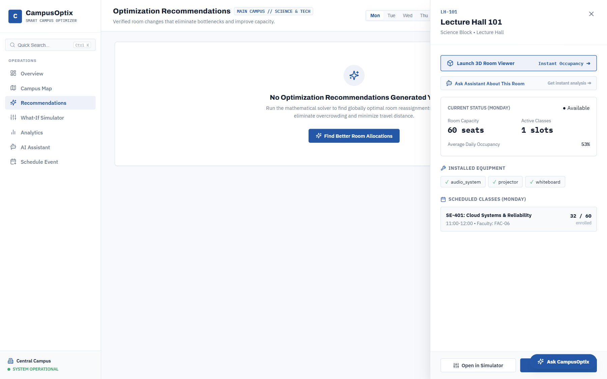

### 5. Deterministic Rule Trace Modal
Audit trail for individual recommendations verifying capacity compliance, equipment prerequisites, faculty non-clash validation, and plain-language reasoning.

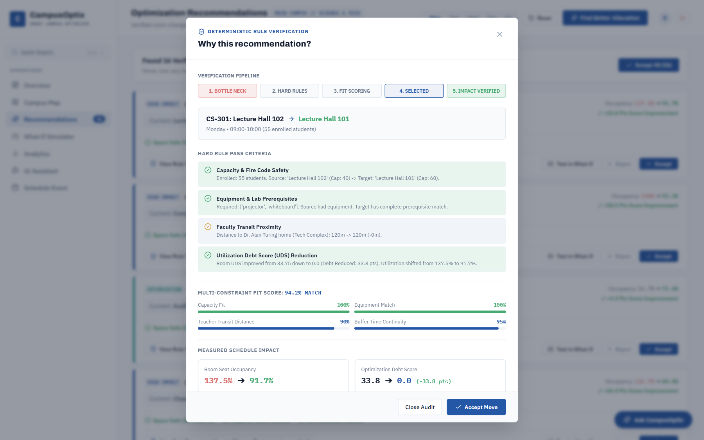

### 6. Scenario Planner & What-If Sandbox
Drag-and-drop schedule canvas enabling administrators to simulate manual course reassignments with real-time Socket.io metric recalculation.

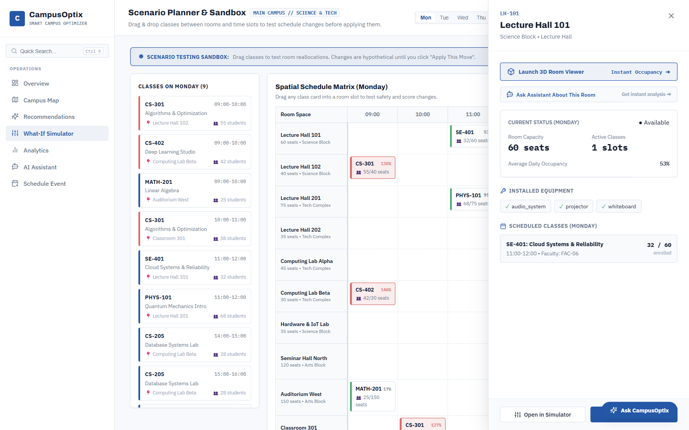

### 7. Impact & Utilization Analytics
Deep-dive analytical matrix displaying UDS debt factor distribution (idle capacity vs. mismatch vs. overcapacity), building utilization distributions, and recovered seat metrics.

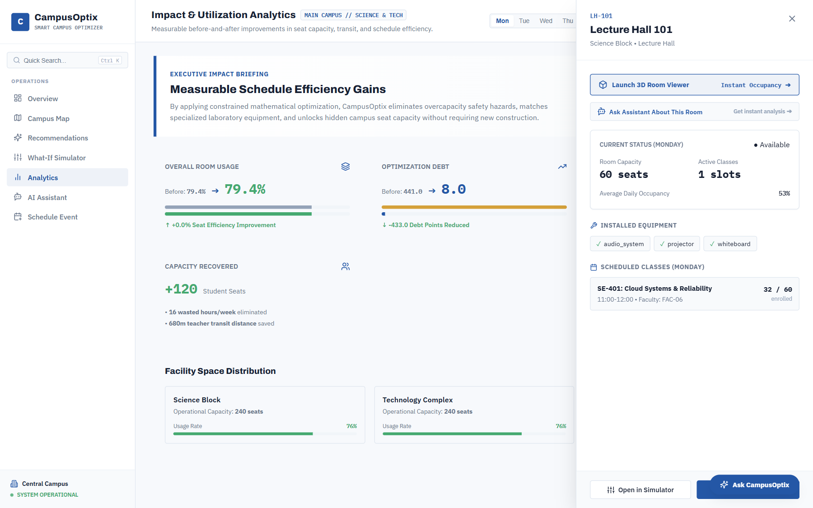

### 8. Context-Aware AI Operations Assistant
Conversational interface answering operational queries from real campus records, executing UI actions, and offering persistent contextual follow-up inquiries.

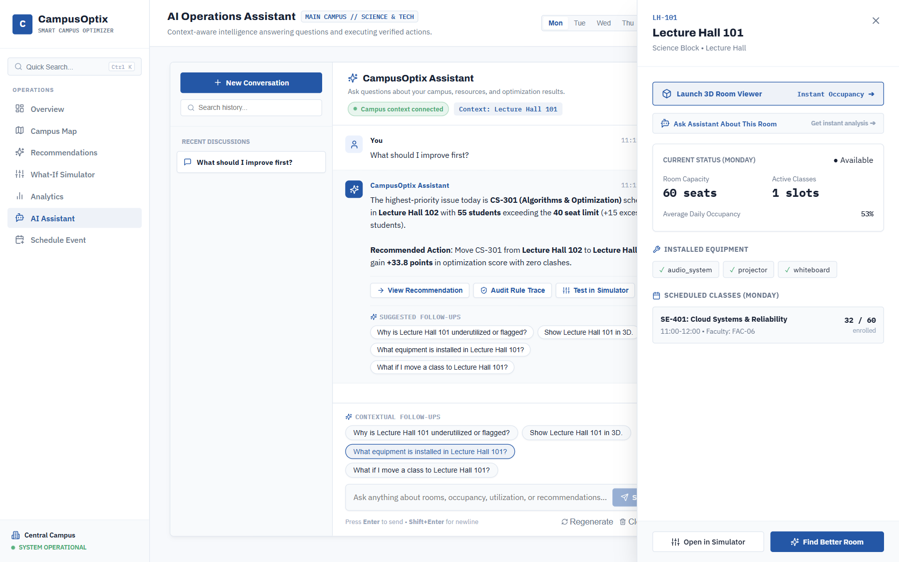

### 9. Conflict-Free New Event Scheduler
Graph-coloring slot recommendation engine calculating zero-conflict options ranked by a multi-constraint Fit Score for ad-hoc lectures and seminars.

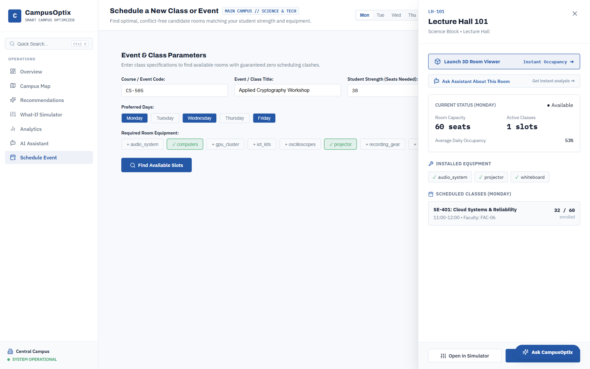

---

## Screenshot Gallery

| Overview Dashboard | Campus Floor Plan |
| :---: | :---: |
|  |  |
| **Optimization Recommendations** | **Deterministic Rule Trace** |
|  |  |
| **What-If Scenario Planner** | **Context-Aware AI Assistant** |
|  |  |

---

## Architecture & Data Flow

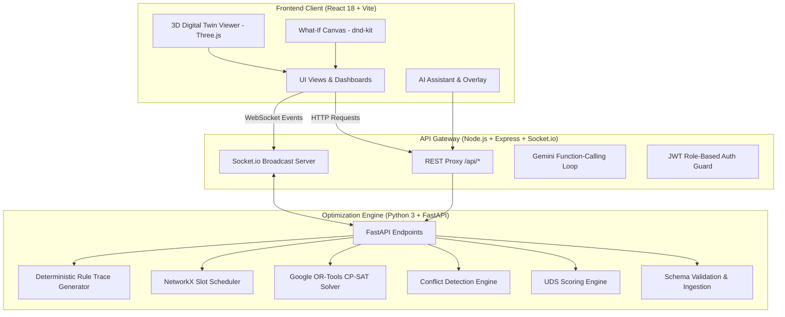

---

## How Optimization Works

### 1. Hard Constraints (OR-Tools CP-SAT)
The optimization engine enforces the following mathematical constraints:
- **No Room Double-Booking**: A room $r$ can host at most one event $e$ at day $d$ and time slot $s$:
  $$\sum_{e \in E(d, s)} x_{e, r} \le 1 \quad \forall r \in R, d \in D, s \in S$$
- **No Faculty Time Clashes**: A faculty member $f$ cannot teach in two different rooms at the same day and slot:
  $$\sum_{e \in E(f, d, s)} \sum_{r \in R} x_{e, r} \le 1 \quad \forall f \in F, d \in D, s \in S$$
- **Equipment Prerequisite Matching**: An event $e$ requiring equipment set $Q_e$ cannot be assigned to room $r$ unless $Q_e \subseteq Q_r$:
  $$x_{e, r} = 0 \quad \text{if } Q_e \not\subseteq Q_r$$
- **Multi-Slot Lab Room Continuity**: Consecutive laboratory slots for the same course must remain in the same physical room.

### 2. Utilization Debt Score (UDS) Formula
$$\text{UDS}(\text{room}, \text{slot}) = w_1 \cdot \text{idle\_penalty} + w_2 \cdot \text{mismatch\_penalty} + w_3 \cdot \text{overcap\_penalty}$$

- **Idle Penalty**: $\max(0, 0.60 - \text{utilization}) \times 10.0$ *(penalizes allocating large halls for tiny cohorts)*
- **Overcapacity Penalty**: $\max(0, \text{utilization} - 1.0) \times 30.0$ *(strict penalty for fire-safety overcapacity)*
- **Equipment Mismatch Penalty**: $15.0 \text{ if required equipment is missing else } 0$
- **Default Weights**: $w_1 = 1.0$, $w_2 = 1.5$, $w_3 = 3.0$

### 3. Multi-Constraint Fit Score
$$\text{Fit} = \text{capacity\_fit} + \text{equipment\_fit} + \text{travel\_fit} + \text{buffer\_fit}$$
Evaluates candidate room-slots for ad-hoc events by balancing capacity utilization (60–90%), equipment matching, minimal faculty walking distance, and adjacent schedule buffers.

### 4. Deterministic Rule Trace
Rather than generating black-box answers, the engine logs the exact constraint checks performed during optimization:
- Initial state verification (room, capacity, enrolled students, active equipment).
- Target room verification (capacity headroom, hardware inventory match, timetable vacancy).
- Mathematical delta calculation ($\Delta\text{UDS}$, utilization change percentage, zero conflict proof).

---

## AI Operations Assistant

CampusOptix integrates a context-aware assistant built with the Google Gemini API:

- **Source of Truth**: The assistant does not generate speculative answers; it queries 18 specialized backend data tools (`get_campus_summary`, `get_room_details`, `get_underutilized_rooms`, `get_overcapacity_rooms`, `get_recommendations`, etc.) to retrieve live data before answering.
- **Answer First, Action Second**: Every turn produces a factual natural-language summary with exact room and capacity metrics before attaching interactive UI action buttons.
- **Persistent Contextual Follow-Ups**: Suggestion chips dynamically update turn-after-turn based on the conversation context.
- **Deterministic Fallback**: If an external API key is not configured, the system automatically uses an internal deterministic expert rules engine to answer campus queries.

---

## Tech Stack

| Layer | Technology | Role |
| :--- | :--- | :--- |
| **Optimization Engine** | Python 3, FastAPI, Pydantic | Backend REST service and data ingestion |
| **Solver & Graph Engine** | Google OR-Tools (CP-SAT), NetworkX | Integer programming constraint solver & graph-coloring slot finder |
| **Data Processing** | Pandas, NumPy | Timetable parsing, distance matrix calculations, UDS scoring |
| **API Gateway** | Node.js, Express, Socket.io | Reverse proxy, WebSocket broadcast server, JWT authentication |
| **AI Integration** | `@google/genai` (Gemini 2.5 Flash) | Context-grounded multi-turn function-calling assistant |
| **Frontend Framework** | React 18, Vite | Component-driven Single Page Application |
| **3D Digital Twin** | Three.js, `@react-three/fiber`, `@react-three/drei` | 3D room canvas, procedural furniture, seated student meshes |
| **Interactive Sandbox** | `@dnd-kit/core`, `@dnd-kit/utilities` | Drag-and-drop timetable reallocations |
| **Icons & Typography** | Lucide React, Archivo, IBM Plex Sans, IBM Plex Mono | "The Blueprint" architectural design system |

---

## Project Structure

```
CampusOptix/
├── backend/                  # FastAPI Optimization Backend (Port 8000)
│   ├── data/                 # Campus dataset CSVs (rooms, faculty, timetable, distances)
│   ├── src/
│   │   ├── ingestion.py      # Schema validation & dataset loading
│   │   ├── utilization.py    # UDS scoring & utilization matrix calculations
│   │   ├── conflicts.py      # Multi-dimensional conflict detection
│   │   ├── optimizer.py      # Google OR-Tools CP-SAT solver
│   │   ├── explainer.py      # Deterministic Rule-Trace & Rejection explainers
│   │   ├── impact.py         # Institutional impact & delta metrics calculator
│   │   └── scheduler_graph.py# NetworkX graph-coloring slot finder
│   ├── tests/                # Automated test suite
│   ├── main.py               # FastAPI application & REST endpoints
│   └── requirements.txt      # Python dependencies
├── gateway/                  # Node.js Express & Socket.io Gateway (Port 4000)
│   ├── src/
│   │   ├── assistantService.js # Gemini function-calling loop & follow-up generator
│   │   ├── assistantTools.js   # 18 concrete campus data retrieval tools
│   │   ├── auth.js             # JWT authentication & role-based validation
│   │   ├── routes.js           # REST proxy & assistant API endpoints
│   │   └── socket.js           # WebSocket broadcast handlers
│   ├── server.js             # Gateway entrypoint
│   └── package.json
├── frontend/                 # React 18 + Vite SPA (Port 5173)
│   ├── src/
│   │   ├── components/
│   │   │   ├── 3d/           # Shared 3D Room Viewer & Architectural Templates
│   │   │   ├── assistant/    # AI Assistant Page, Floating Overlay & Composer
│   │   │   ├── auth/         # Login Page & Role Routing Shell
│   │   │   ├── dashboards/   # Student Portal & Faculty Dashboard
│   │   │   ├── OverviewPage.jsx
│   │   │   ├── CampusMapPage.jsx
│   │   │   ├── RecommendationsPage.jsx
│   │   │   ├── WhatIfSimulatorPage.jsx
│   │   │   ├── ScheduleEventPage.jsx
│   │   │   ├── AnalyticsPage.jsx
│   │   │   ├── CommandPalette.jsx
│   │   │   └── RoomDrawer.jsx
│   │   ├── styles/tokens.css # "The Blueprint" design tokens & theme
│   │   ├── App.jsx           # Master application container & state synchronizer
│   │   └── main.jsx          # React entrypoint & Global Error Boundary
│   ├── vite.config.js        # Vite dev server & proxy configuration
│   └── package.json
├── docs/
│   └── screenshots/          # Real verified product screenshots (1440x900)
├── package.json              # Monorepo root scripts (concurrent dev runner)
└── README.md                 # Project documentation
```

---

## Getting Started

### Prerequisites
- **Python 3.10+** (with virtual environment support)
- **Node.js 18+** (with `npm`)
- **Git**

---

### Step 1: Clone Repository & Set Up Python Environment
```bash
# Set up Python virtual environment
python -m venv .venv

# On Windows:
.venv\Scripts\activate
pip install -r backend/requirements.txt

# On macOS/Linux:
source .venv/bin/activate
pip install -r backend/requirements.txt
```

---

### Step 2: Install Node Dependencies
```bash
# Install root, gateway, and frontend packages
npm install
cd gateway && npm install && cd ..
cd frontend && npm install && cd ..
```

---

### Step 3: Configure Environment Variables (Optional)
Create or verify `gateway/.env`:
```env
PORT=4000
BACKEND_URL=http://localhost:8000
GEMINI_API_KEY=your_gemini_api_key_here
GEMINI_MODEL=gemini-2.5-flash
```
*(If `GEMINI_API_KEY` is omitted, the assistant operates using the built-in deterministic expert engine).*

---

### Step 4: Run Backend Verification Tests
```bash
.venv\Scripts\pytest backend/tests/ -v
# On macOS/Linux: pytest backend/tests/ -v
```

---

### Step 5: Start Full-Stack Application
```bash
npm run dev
```

This concurrently launches:
- **Frontend SPA**: [http://localhost:5173](http://localhost:5173)
- **API Gateway & WebSockets**: `http://localhost:4000`
- **FastAPI Optimization Backend**: `http://localhost:8000` *(Interactive Swagger Docs: [http://localhost:8000/docs](http://localhost:8000/docs))*

---

## Recommended Demo Walkthrough

1. **Login Screen**: Navigate to [http://localhost:5173](http://localhost:5173). Select the **Campus Admin** tab and click **Sign In to Campus Admin** (`admin@campusoptix.edu` / `admin123`).
2. **Identify Bottlenecks**: On the **Overview Dashboard**, inspect the total Campus UDS, active conflict alerts, and capacity overruns.
3. **Inspect Space & 3D Twin**: Navigate to **Campus Map**, click on a room (e.g. `Lecture Hall 101`), and click **Launch 3D Room Viewer** to view procedural furniture and live seated student avatars.
4. **Run Optimization**: Click **Find Better Allocation** in the header. The OR-Tools CP-SAT solver computes verified reassignments in milliseconds.
5. **Inspect Rule Trace**: On the **Recommendations** page, click **View Rule Trace** to audit the exact capacity math, equipment checklist, and non-clash validation.
6. **Test Scenario**: Click **Test in What-If** to open the interactive sandbox, drag classes between rooms/slots, and observe real-time UDS recalculations.
7. **Ask AI Assistant**: Open the **AI Assistant** (or floating drawer), click `"What should I improve first?"`, and review the factual written response and contextual follow-up inquiries.
8. **Test Role Portals**: Log out and sign in as **Faculty** (`faculty@campusoptix.edu` / `faculty123`) or **Student** (`student@campusoptix.edu` / `student123`) to test role-specific workflows and single-click `"Find Better Room"` 3D viewer transitions.

---

## Implementation Status

| Feature / Module | Status | Verification Detail |
| :--- | :---: | :--- |
| **OR-Tools CP-SAT Optimization Solver** | ✅ Implemented | Tested against multi-constraint formulation in `test_pipeline.py`. |
| **Utilization Debt Score (UDS) Engine** | ✅ Implemented | Mathematical penalties for idle capacity, mismatch, and overcapacity. |
| **Deterministic Rule Trace & Explainer** | ✅ Implemented | Full constraint verification audit trail and before/after metrics. |
| **Interactive 3D Digital Twin Viewer** | ✅ Implemented | Shared Three.js modal with 5 room templates and seated student meshes. |
| **2D Multi-Layer Campus Floor Plan** | ✅ Implemented | Multi-building spatial map with slide-in room telemetry drawers. |
| **What-If Scenario Sandbox** | ✅ Implemented | Real-time `@dnd-kit` drag-and-drop with Socket.io metric recalculation. |
| **Role-Based Authentication & Portals** | ✅ Implemented | Server-validated JWT auth for Admin, Faculty, and Student roles. |
| **Context-Aware AI Operations Assistant** | ✅ Implemented | Multi-turn Gemini function-calling loop with deterministic expert fallback. |
| **Conflict-Free New Event Scheduler** | ✅ Implemented | NetworkX graph-coloring slot finder with Multi-Constraint Fit Scores. |
| **Automated Test Suite** | ✅ Implemented | 8/8 Pytest suite passing in under 1.1 seconds. |

---

## Limitations

- **Sample Dataset**: Uses synthetic university campus data modeled on typical multi-department STEM facilities.
- **SIS / ERP Integrations**: Operates via structured CSV/JSON interfaces; direct live synchronization connectors for Banner, PeopleSoft, or Canvas are planned.
- **AI Model Dependency**: Natural-language synthesis utilizes Gemini API; when operating without an internet connection or API key, queries are processed via the built-in deterministic rule engine.

---

## Future Scope

1. **IoT Sensor Integration**: Live integration with PIR motion detectors, Wi-Fi access point density telemetry, and CO₂ air quality monitors.
2. **Multi-Campus Multi-Tenant Clustering**: Scaling the OR-Tools integer programming model across geographically distributed satellite campuses.
3. **Automated HVAC & Facility Control**: Dispatching schedule-linked pre-cooling and lighting commands based on verified room allocations.

---

## Hackathon Context

- **Event**: Spiderverse Hackathon 2026
- **Organizer**: ASCAI
- **Problem Statement 3**: Smart Campus Resource & Classroom Optimizer
- **Solution**: CampusOptix — Deterministic Constraint Optimization, Explainable Rule Traces & Interactive 3D Spatial Digital Twin.
